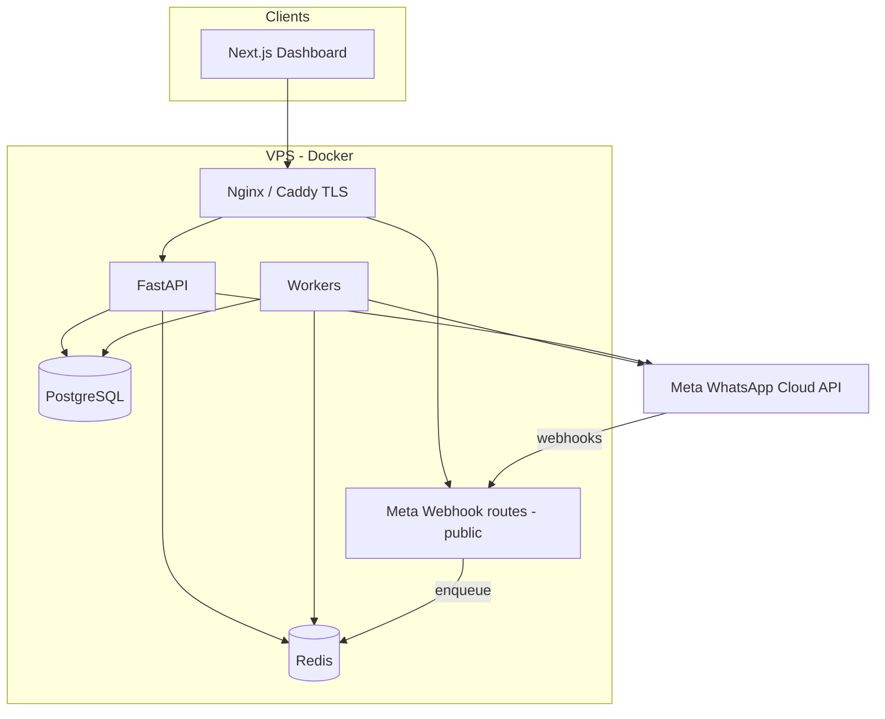

# WhatsApp API SaaS — Full Implementation Plan

> **Status:** planning document. Workspace bootstraps from this file.  
> **Goal:** Production-oriented MVP for a WhatsApp messaging CRM, **direct [WhatsApp Cloud API](https://developers.facebook.com/docs/whatsapp/cloud-api)** (no third-party BSP). Comparable positioning to products like WATI or AiSensy, but you own the Meta integration.

---

## 1. Product scope

### 1.1 In scope (MVP)

| Area | Features |
|------|----------|
| **CRM** | Create / update / delete contacts; tags; custom attributes (JSON); dynamic filters (bounded, server-side). |
| **Templates** | Store template metadata; sync (or mirror) with Meta; API to send template messages. |
| **Send engine** | Cloud API: templates; text / image / document per official constraints (see §7). |
| **Campaigns** | CSV upload; bulk send; scheduling; workers; retry with backoff and max attempts. |
| **Webhooks** | Inbound messages; `sent` / `delivered` / `read` / `failed` status; persist conversations/messages. |
| **Dashboard** | Contacts; campaigns; message logs; settings (e.g. masked credentials); **React (Next.js) + Tailwind**. |
| **Security** | **JWT** auth; **admin** / **agent** roles; **API rate limiting**. |

### 1.2 Out of scope (design only, do not build in MVP)

- Chatbot flow builder  
- Multi-agent live chat  
- Full analytics dashboard  
- Full automation / workflow engine  

*Optional:* reserve nullable tables or folder placeholders so later features do not require a full schema rewrite.

---

## 2. Technology stack (fixed)

| Layer | Choice | Notes |
|--------|--------|--------|
| Backend | **Python 3.12+**, **FastAPI**, **Pydantic v2** | OpenAPI; async where useful. |
| Database | **PostgreSQL 16+**, **SQLAlchemy 2.x**, **Alembic** | Migrations are mandatory. |
| Queue / cache | **Redis 7+** | Campaign jobs, throttling, short-lived idempotency, scheduling helpers. |
| Workers | **Celery** *or* **ARQ** (choose one) | **ARQ** pairs well with async; **Celery** is ubiquitous. Pick before Phase 7. |
| HTTP client to Meta | **httpx** | Timeouts, retries (careful with Meta rate limits). |
| Frontend | **Next.js** (App Router), **TypeScript**, **Tailwind CSS** | BFF or direct API to FastAPI; align CORS. |
| Auth | **JWT** (access; optional refresh) | Passwords: e.g. **Argon2id**. |
| Rate limiting | e.g. **slowapi** or Starlette-based middleware | By IP (auth) and by **tenant** + user for API. |
| Deployment | **Docker** + **Docker Compose** on **VPS** | Nginx or Caddy for TLS termination. |
| Secrets | **Encryption at rest** for Meta tokens in DB (e.g. **Fernet** + `ENCRYPTION_KEY` in env) | Never log full tokens. |

**Non-goals for MVP:** Kubernetes (optional later), multi-region (optional later).

---

## 3. “Changeless” decisions (do not keep revisiting)

1. **Direct Cloud API only** — one Meta integration module; no Gupshup / Twilio BSP in the message path.  
2. **Multi-tenant from day one** — every business-owned row is scoped with `tenant_id` (or equivalent).  
3. **Webhooks: respond `200` immediately**; verify signature; enqueue work; **idempotent** processing (`wamid` / event keys).  
4. **Bulk / campaign send only via background workers** — not a single long HTTP handler loop.  
5. **WhatsApp policy in code** — business-initiated contact uses **approved templates**; free-form and session messages only where the **24-hour customer service window** and API allow.  
6. **Stack** — FastAPI + Postgres + Redis + Next.js + Docker unless the project explicitly re-scopes.

---

## 4. Architecture overview



- **API:** JWT + RBAC; all tenant routes resolve `tenant_id` from membership (never from unchecked client id).  
- **Webhook service:** `GET` verification + `POST` with **HMAC-SHA256** (`X-Hub-Signature-256` + App Secret). Route inbound events to tenant by **`phone_number_id`** in `metadata`.  
- **Campaign pipeline:** create campaign → enqueue per-recipient jobs → worker throttles (see §7) → Graph API send → store `wamid` → update from status webhooks.

---

## 5. Meta / WhatsApp Cloud API (implementation notes)

| Topic | Practice |
|--------|----------|
| **Webhook verify (GET)** | `hub.mode == subscribe`, `hub.verify_token` matches configured token → return `hub.challenge` with 200. |
| **POST** | Parse `entry[0].changes[0].value` for `messages` (inbound) and `statuses` (outbound lifecycle). |
| **Signature** | Verify HMAC; constant-time compare. |
| **Throughput** | Default **~80 mps** per business phone number on Cloud API; higher tiers possible per Meta. Error **130429** when over limit. **Pair** limits: do not flood a single user. [Throughput](https://developers.facebook.com/docs/whatsapp/throughput) |
| **Webhooks load** | Meta can send many concurrent POSTs; target **median &lt; ~250ms**; design for **~3×** status volume vs send rate in heavy scenarios. |
| **Tokens** | Prefer long-lived / System User pattern for production; plan refresh and failure alerts. |
| **24h window** | Session messages (text/media) for replies inside window; **cold outbound** = templates. |

---

## 6. Database (logical model)

**Principle:** all business data keyed by `tenant_id`.

| Table / entity | Purpose |
|----------------|---------|
| `tenants` | Organization, slug, status. |
| `users` | Global identity (email, password hash). |
| `memberships` | `user_id` + `tenant_id` + `role` (`admin` \| `agent`). |
| `whatsapp_connections` | `tenant_id`, `phone_number_id`, optional `waba_id`, **encrypted** `access_token`, **encrypted** `app_secret` (or reference), display number, `is_active`. |
| `contacts` | `tenant_id`, E.164 phone, name, `custom_attributes` **JSONB**, `last_inbound_at` (for UI hints), optional opt-in timestamp. |
| `tags` | `tenant_id`, name. |
| `contact_tags` | M:N contact ↔ tag. |
| `message_templates` | `tenant_id`, name, language, category, Meta status, `components` JSONB, `last_synced_at`. |
| `conversations` | `tenant_id`, `contact_id`, `whatsapp_connection_id`, `last_message_at`. |
| `messages` | `tenant_id`, `conversation_id`, direction, `wamid`, `type`, payload **JSONB**, `status`, error code, `idempotency_key`. |
| `campaigns` | `tenant_id`, name, template or payload ref, `status`, `schedule_at`, `created_by`. |
| `campaign_recipients` | `campaign_id`, `contact_id`, `state`, `wamid`, `attempts`, `next_retry_at`. |
| `import_jobs` | CSV metadata, file location, results / error report. |
| `audit_logs` (recommended) | Who changed WABA, sent campaign, etc. |
| `webhook_events` (optional) | Truncate / TTL for debug; or sample only in MVP. |

**Indexes (minimum):** `(tenant_id, created_at)` on `messages`, `(tenant_id, phone_e164)` unique on `contacts`, GIN on `custom_attributes` if filtering by key paths.

---

## 7. Backend API (illustrative routes)

Prefix e.g. `/v1/`. All routes except public webhook and auth are **JWT** + **tenant** + **role**.

**Auth**  
- `POST /v1/auth/register`  
- `POST /v1/auth/login`  
- `POST /v1/auth/refresh` (if using refresh tokens)  

**Tenant / me**  
- `GET/PUT` current tenant (as designed)  
- `GET/POST/PUT` `whatsapp_connections` (admin only)  

**CRM**  
- `CRUD /v1/contacts`  
- `POST /v1/contacts/filter` (or query params + POST body for complex filters)  
- `CRUD /v1/tags`  

**Templates**  
- `GET /v1/templates` (list + optional `POST .../sync`)  

**Messages**  
- `POST /v1/messages` (template send; session send when policy allows)  

**Campaigns**  
- `POST/GET/GET:id /v1/campaigns`  
- `POST /v1/campaigns/{id}/start`  
- `POST /v1/imports` (CSV)  

**Meta webhook (no JWT)**  
- `GET /webhook/whatsapp` — verification  
- `POST /webhook/whatsapp` — events  

*Exact path names are implementation details; keep one stable callback URL for Meta’s dashboard.*

---

## 8. Folder structure (target)

```text
msg service/
  PLAN.md                 # this file
  backend/
    app/
      main.py
      core/               # settings, security, deps, rate limits
      db/                 # session, base, alembic
      models/
      schemas/
      api/
        v1/               # routers: auth, contacts, campaigns, ...
        webhooks/         # meta
      services/
        meta/             # client, webhook parser, idempotency
      workers/            # tasks, scheduling hooks
    alembic/
    tests/
    Dockerfile
    requirements.txt
  frontend/
    app/                  # Next.js App Router
    components/
    lib/
    Dockerfile
  docker-compose.yml
  .env.example
```

---

## 9. Frontend (MVP pages)

| Page | Purpose |
|------|---------|
| Login / register | Auth. |
| Contacts | List, create, edit, tags, filters. |
| Campaigns | Create (template, audience from filter or import), schedule, start, see progress. |
| Message logs | Table: time, contact, type, status, error. |
| Settings | Connection masked; webhook URL instructions; (optional) test send. |

Use a small API client (`fetch` or axios) with token attachment; handle 401 → refresh or re-login.

---

## 10. Phased delivery plan (execution order)

| Phase | Deliverable | Exit criterion |
|-------|-------------|----------------|
| **0** | Repo structure, `docker-compose`, env template, `README` | `docker compose up` brings up Postgres, Redis, API. |
| **1** | Schema for tenants/users/memberships; Alembic; JWT + RBAC | Can register, login, access role-protected route. |
| **2** | `whatsapp_connections` + encryption; Meta `httpx` client; one successful API send to a test number | End-to-end Meta from backend. |
| **3** | Webhook GET/POST + HMAC; enqueue; persist messages + statuses; idempotency | Inbound and status update visible in DB. |
| **4** | Contacts, tags, attributes, filter API | CRM usable for campaigns. |
| **5** | Template storage + sync | Campaign can reference real templates. |
| **6** | `POST /messages` (template + session rules) + media as needed | One-off send matches policy. |
| **7** | Campaigns, CSV, Redis queue, worker, throttle, schedule, retry | Bulk send stable under load tests. |
| **8** | Next.js pages wired to API | End-user can run full flow from UI. |
| **9** | Rate limits, audit, health, deployment doc | “Production checklist” pass. |

---

## 11. Docker / deployment (VPS)

1. Public hostnames: e.g. `api.example.com` (webhooks + API), `app.example.com` (Next).  
2. TLS: **Caddy** or **Nginx** + Let’s Encrypt.  
3. `docker compose`: `api`, `worker`, `postgres`, `redis`; optional `web` (Next) or static export behind same proxy.  
4. **Do not** expose Postgres or Redis to the internet.  
5. Meta App: set callback to `https://api.../webhook/whatsapp` (or chosen path), verify token, app secret for signature.  
6. Run **Alembic** on deploy.  
7. **Backups:** automated Postgres backups (host-level or container policy).

---

## 12. Main risks and mitigations (challenges)

| Risk | Mitigation |
|------|------------|
| Template not approved or rejected | Sync + show Meta status; block sends that will fail. |
| Token expiry | Long-lived / rotation procedure; admin alerts. |
| **130429** / throughput | Per-`phone_number_id` throttling, queue, backoff, metrics. |
| Webhook storm | Fast ack; horizontal API instances; consider dedicated webhook process later. |
| Legal / opt-in | Document tenant responsibility; optional `opt_in` fields. |

---

## 13. Open product decision (before Phase 2)

- **A — Manual:** each tenant **pastes** long-lived System User–style token in **Settings** (fastest MVP).  
- **B — Embedded Signup:** Meta OAuth / embedded flow (more work; better for self-serve SaaS).  

The rest of the plan (CRM, webhooks, campaigns) is the same; only **onboarding** and **token lifecycle** differ.

---

## 14. Reference links

- [WhatsApp Cloud API](https://developers.facebook.com/docs/whatsapp/cloud-api)  
- [Webhooks](https://developers.facebook.com/docs/whatsapp/webhooks/)  
- [Messages webhook](https://developers.facebook.com/docs/whatsapp/cloud-api/webhooks/reference/messages/)  
- [Throughput](https://developers.facebook.com/docs/whatsapp/throughput)  

---

*Last updated: aligned with project kickoff. Update this file when phases close or the stack / scope changes.*
