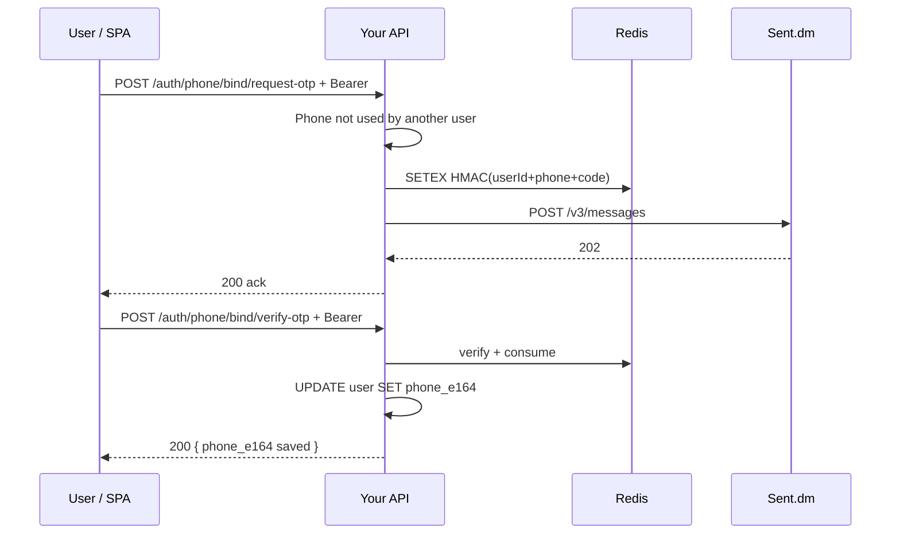

# Sent.dm SMS OTP: integration guide for developers

This document describes **what we built** in this repository: **phone-based sign-in** using a **6-digit OTP** delivered by **SMS** through **[Sent.dm](https://docs.sent.dm/)**, alongside unchanged **email + password** login. It is written so another team can **replicate the same pattern** in a different CRM or backend.

Official Sent references:

- [Sent API documentation](https://docs.sent.dm/)
- [Sending messages](https://docs.sent.dm/start/guides/sending-messages) (SMS, templates, `x-api-key`)
- [Send a message (API reference)](https://docs.sent.dm/reference/api/messages/SentDmServicesEndpointsCustomerAPIv3MessagesSendMessageV3Endpoint)

---

## 1. Product behaviour (what the user sees)

| Flow | Who | What happens |
|------|-----|----------------|
| **Email + password** | Everyone with credentials | Unchanged: `POST /auth/login` returns a JWT. |
| **Phone + SMS OTP** | Users who have a **mobile stored** on their account (`phone_e164`) | Step 1: request OTP → SMS via Sent. Step 2: verify OTP → same JWT shape as password login. |
| **Register with optional phone** | New signups | Optional `phone_e164` on register so SMS login works immediately after signup. |
| **Bind phone (existing user)** | Logged-in user with **no** (or new) number | **Settings** (or equivalent): send OTP to the number they type → verify → persist `phone_e164` on the user. |

**India-friendly input (this repo):** if the user omits `+` and enters a **10-digit** mobile starting with **6–9**, or a **12-digit** `91…` number, we normalize to **`+91…`** before validating E.164. Other countries should use full **E.164** with `+` (or extend normalization rules in your CRM).

---

## 2. How Sent.dm fits in (conceptual)

Sent.dm is a **hosted messaging API**. You do **not** send raw SMS text for OTP in the simple case; you send a **template message**:

1. You create / get approved an **SMS template** in Sent (dashboard at [app.sent.dm](https://app.sent.dm/)), with **placeholders** (e.g. `{{code}}`, `{{otp}}` — exact names depend on the template).
2. Your server calls **`POST https://api.sent.dm/v3/messages`** with:
   - Header **`x-api-key`**: your API key.
   - JSON body: recipients (`to`), optional **`channel`: `["sms"]`**, and **`template.id`** plus **`template.parameters`**: a **dictionary** whose **keys must match** the template variable names exactly.
3. Sent returns **202** (or **200**) with `success: true` and per-recipient `message_id` when the message is queued.

If a required template variable is missing, Sent returns **400** with something like:

```json
"details": { "code": ["'code' is required"] }
```

That means your app sent `parameters: { "otp": "123456" }` but the template requires **`code`**. Fix by aligning env/config with the template (see §5).

---

## 3. HTTP contract we use (minimal)

**Endpoint:** `POST https://api.sent.dm/v3/messages`

**Headers:**

| Header | Value |
|--------|--------|
| `x-api-key` | Sent API key (server secret, never in frontend) |
| `Content-Type` | `application/json` |
| `Idempotency-Key` | Random UUID per request (recommended by Sent) |

**Body (SMS OTP in this repo):**

```json
{
  "to": ["+919876543210"],
  "channel": ["sms"],
  "template": {
    "id": "<your-template-uuid>",
    "parameters": {
      "code": "482917"
    }
  }
}
```

- **`to`**: E.164 strings (array).
- **`channel`**: `["sms"]` forces SMS (see Sent guide; omitting `channel` lets Sent auto-pick channel).
- **`template.id`**: the template ID from Sent (UUID string).
- **`template.parameters`**: map of **placeholder name → string value**. The **6-digit OTP** is passed as the value; the **key** must match the template.

**Success:** HTTP **200** or **202** and JSON `success: true`.

**Failure:** 4xx/5xx with `success: false` and `error.code`, `error.message`, often `error.details` for validation.

Implementation in this repo: `backend/app/services/sent_dm.py` (`send_sms_with_template`).

---

## 4. Security and OTP handling (server-side)

### 4.1 Never trust the client for secrets

- **API key** and **template id** live only in **server environment** (e.g. `.env` consumed by Docker or your process manager).
- The **browser** only calls **your** API; it never talks to Sent.dm with the API key.

### 4.2 Store OTP briefly, hashed — not plaintext (recommended pattern)

We store OTP verification state in **Redis** (same Redis as the rest of the app):

| Purpose | Redis key pattern | What is stored |
|---------|-------------------|----------------|
| **Login OTP** | `phone_otp:v1:{phone_e164}` | **HMAC-SHA256** of `(phone_e164 + ":" + code)` with a server secret (we use `JWT_SECRET_KEY` as pepper — your CRM can use a dedicated `OTP_PEPPER`). |
| **Bind-phone OTP** | `phone_bind_otp:v1:{user_id}:{phone_e164}` | Same idea but HMAC includes **`user_id`** so a code minted for user A cannot be applied to user B. |

Properties:

- **TTL** configurable (e.g. 600 seconds): key expires automatically.
- **Single use:** on successful verify, **delete** the Redis key.
- **Constant-time compare:** use `hmac.compare_digest` (or equivalent) when checking the code.

Code: `backend/app/services/phone_otp.py`.

### 4.3 Rate limits

We throttle by **IP** and by **phone** (and by **user** for bind). Tune limits for your CRM. Code: `backend/app/core/rate_limit.py` + calls in `backend/app/api/v1/auth.py`.

### 4.4 Login “request OTP” without leaking registration

For **unauthenticated** login OTP, if the phone is **not** on an account (or user inactive), we **still** return the **same generic JSON message** and **do not send** SMS. That avoids burning SMS budget and reduces trivial enumeration (trade-off: inactive accounts get no SMS — they must use email or fix status).

---

## 5. Configuration (environment variables)

| Variable | Purpose |
|----------|---------|
| `SENT_DM_API_KEY` | Sent `x-api-key` value. |
| `SENT_DM_TEMPLATE_ID` | Approved SMS template UUID in Sent. |
| `SENT_DM_OTP_PARAMETER_NAME` | **JSON key** for the OTP in `template.parameters` — must match the template (e.g. `code`, `otp`, `verification_code`). |
| `PHONE_LOGIN_OTP_TTL_SECONDS` | Optional; OTP validity window (seconds). |
| `REDIS_URL` | Required for OTP state. |

**Docker note:** Compose injects `.env` into the container **at create time**. After editing `.env`, **recreate** the backend container (or restart the process) so variables appear in `printenv` / `Settings()`.

**Pydantic note:** This app caches `get_settings()` with `@lru_cache`. Changing env requires a **process restart** to pick up new values.

---

## 6. API surface we expose (your CRM can mirror this)

All routes are under your API prefix (here: `/api/v1`).

| Method | Path | Auth | Description |
|--------|------|------|-------------|
| `POST` | `/auth/register` | No | Optional body field `phone_e164` stores mobile on the new user. |
| `POST` | `/auth/login` | No | Email + password JWT (unchanged). |
| `POST` | `/auth/phone/request-otp` | No | If Sent configured and user exists + active: generate 6-digit code, store in Redis, SMS via Sent. Always returns a generic “if registered you’ll get SMS” style payload for unknown/inactive numbers. |
| `POST` | `/auth/phone/verify-otp` | No | Validates Redis OTP, returns JWT. |
| `POST` | `/auth/phone/bind/request-otp` | **Bearer JWT** | Sends OTP to bind `phone_e164` to the current user; rejects if number owned by another user. |
| `POST` | `/auth/phone/bind/verify-otp` | **Bearer JWT** | Verifies bind OTP, saves `phone_e164` on user. |
| `GET` | `/auth/me` | **Bearer JWT** | Returns `user.phone_e164` among other profile fields. |

Schemas: `backend/app/schemas/auth.py`.  
Phone normalization: `backend/app/utils/phone_e164.py`.

---

## 7. Sequence diagrams

### 7.1 Phone login (unauthenticated)

```mermaid
sequenceDiagram
  participant U as User / SPA
  participant API as Your API
  participant R as Redis
  participant S as Sent.dm

  U->>API: POST /auth/phone/request-otp { phone_e164 }
  API->>API: Rate limit; lookup user by phone
  alt user missing or inactive
    API-->>U: 200 generic ack (no SMS)
  else user active
    API->>API: Generate 6-digit code
    API->>R: SETEX HMAC(phone+code) TTL
    API->>S: POST /v3/messages (SMS template + parameters)
    S-->>API: 202 success
    API-->>U: 200 generic ack
  end

  U->>API: POST /auth/phone/verify-otp { phone_e164, code }
  API->>R: GET + compare_digest; DEL on success
  alt invalid
    API-->>U: 401
  else valid
    API-->>U: 200 { access_token }
  end
```

### 7.2 Bind phone for existing account (authenticated)



---

## 8. Frontend patterns (portable ideas)

- **Login:** tab “Email & password” vs “Phone & SMS code”; two steps: send code → verify.
- **Settings:** section “SMS sign-in” for users who registered before phone existed: bind flow identical to verify-then-save.
- **UX:** disable “verify” until a code was successfully requested for the **same** normalized E.164 currently in the input (avoids mismatched phone/code).
- **Normalize** phone on the client the same way as the server to avoid user confusion.

This repo: `frontend/app/AppClient.tsx` (auth card + settings card).

---

## 9. Troubleshooting (real issues we hit)

| Symptom | Likely cause |
|---------|----------------|
| `Phone sign-in is not configured on this server` | `SENT_DM_API_KEY` or `SENT_DM_TEMPLATE_ID` empty **in the running process** (unsaved `.env`, or container not recreated). |
| Sent **400** `details: { "code": ["'code' is required"] }` | Template expects parameter key **`code`**; app sent **`otp`**. Set `SENT_DM_OTP_PARAMETER_NAME` to the **exact** key Sent shows for that template. |
| Sent **402 / BUSINESS_003** | Insufficient Sent account balance. |
| Sent **RESOURCE_002** | Wrong template id or template not approved. |
| Generic “Could not send SMS” | Check server logs: we log Sent HTTP status and `error.details`. |

---

## 10. Porting checklist (another CRM)

1. **Sent:** Create SMS template with **one** clear variable for the OTP; note the **exact parameter name** (`code`, `otp`, etc.).
2. **Secrets:** API key + template id only on server; map OTP parameter name in config.
3. **User model:** Store **`phone_e164`** (unique when set); enforce E.164 after normalization.
4. **Redis:** Store **HMAC(code)**, TTL, single-use delete on success; separate keys for **login** vs **bind** (include `user_id` in bind).
5. **HTTP:** Implement the four endpoints (request/verify login, request/verify bind) + rate limits.
6. **Sent client:** `POST https://api.sent.dm/v3/messages` with `x-api-key`, `channel: ["sms"]`, `template.id`, `template.parameters`.
7. **UI:** Login phone flow + authenticated “add phone” flow for legacy users.
8. **Ops:** Document “restart API after `.env` change” and “template parameter name must match Sent”.

---

## 11. File map (this repository)

| Area | Path |
|------|------|
| Sent HTTP client | `backend/app/services/sent_dm.py` |
| Redis OTP helpers | `backend/app/services/phone_otp.py` |
| E.164 + India default normalization | `backend/app/utils/phone_e164.py` |
| Routes + rate limits | `backend/app/api/v1/auth.py` |
| Request/response models | `backend/app/schemas/auth.py` |
| User column | `users.phone_e164` (Alembic revision `20260513_0006`) |
| Example env | `.env.example` |

---

*Last updated to match the Sent.dm v3 messages flow and OTP routes described above.*
